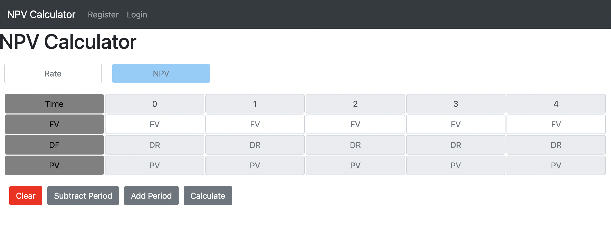
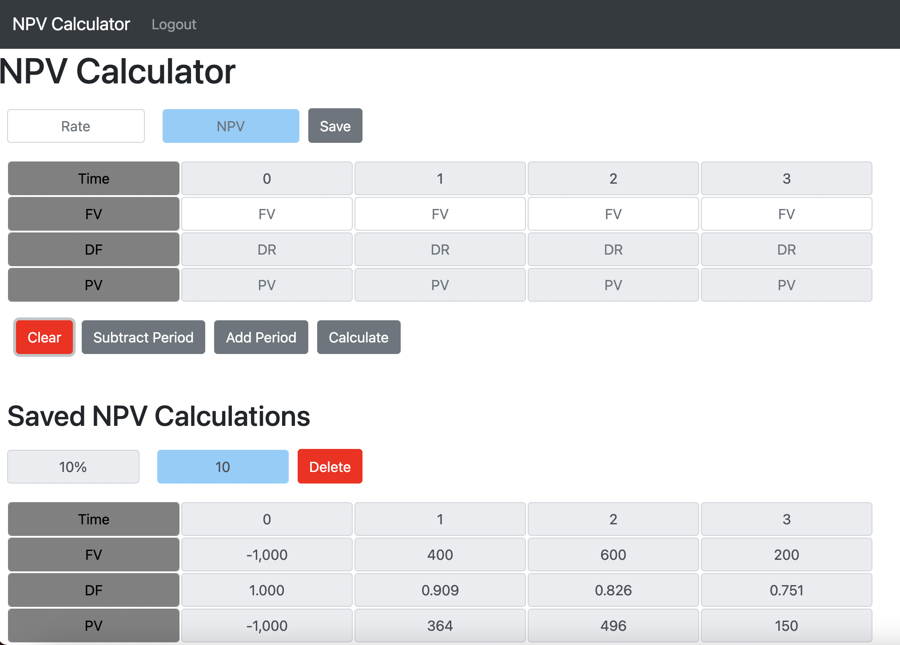

# NPV Calculator

This project is a net present value (NPV) calculator.  NPV is used to determine the present value of future cash flows and to estimate the profitability of an investment.  If the NPV is positive that could mean that a project is worth taking and can be compared to other projects.  Alternatively, if the NPV is negative, the project will not be profitable and should not be pursued.  Potential issues with using NPV include uncertainty with future cash flow estimates.  

### Features Include:
- The user may input anywhere between two and ten periods.
- User inputs include the required rate of return and future value of cash flows for each period.
- User can clear input.
- Users can create an account.
	- Users can save and delete calculations.
	- Token authentication is used to keep users logged in. Tokens are saved as a cookie.

### Technology Used
Front-end tools used are React and Redux. The back-end is a series of APIs created with Django REST Framework.  Other tools used include PostgreSQL, Docker, Webpack.

### Installation
1. Download directory.
2. In directory, run "docker-compose up" in order to create database and start web container.
3. In another window, use "docker ps" in order to obtain the container ID for your web container.
4. Run "docker exec -it CONTAINER_ID bash -l" to enter the container.
5. Run "python3 manage.py make migrations" and "python3 manage.py migrate" to formate the database.
6. Unless changes are made, running "docker-compose up" will start the container and everything should work.
7. If changes are made to the front-end, run "npm run dev" to update the bundle.

### Preview

 

 

 
